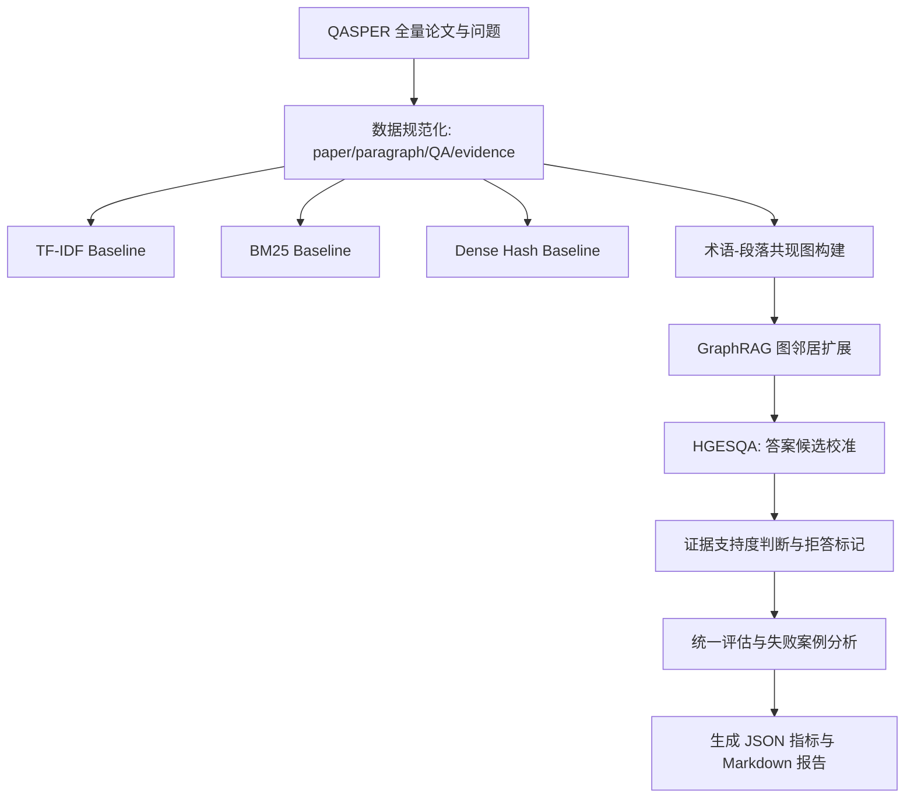
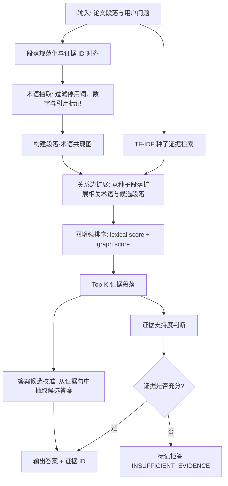

# HGESQA: Hybrid GraphRAG for Evidence-aware Scientific QA

本项目面向长篇科研论文问答任务，基于 QASPER 数据集实现一个可复现的 `Ours: HGESQA` 系统。HGESQA 全称为 **Hybrid GraphRAG for Evidence-aware Scientific QA**。系统目标是在 CPU-only 环境下完成从数据下载、数据审计、证据检索、图增强召回、答案候选校准、拒答判断到实验报告生成的完整流程。

最终全量实验报告见：

`results/qasper_train_full_final/proposal_experiment_report.md`

## 问题背景

科研论文数量持续增长，研究者在做文献综述、方法复现、实验对比或论文精读时，经常需要从长篇论文中快速找到“某个问题的答案是什么、答案来自哪里、是否真的有论文证据支持”。传统关键词搜索只能返回论文或段落，不能直接给出带证据的答案；通用问答系统又容易在证据不足时生成看似合理但无法追溯的回答。因此，面向科研论文的证据约束问答具有明确的问题价值：

- **科研效率价值**：帮助研究者从长论文中快速定位方法、数据集、指标、实验结果和结论，降低人工翻阅成本。
- **科研可信价值**：要求答案绑定原文证据，便于复核、引用和发现模型是否误读论文。
- **知识服务价值**：可作为论文阅读助手、文献综述工具、科研问答系统和学术搜索增强模块的基础能力。
- **评测研究价值**：QASPER 同时考察长文档检索、证据定位、不可回答问题识别和答案生成，是检验科研场景 QA 系统可信性的典型任务。

与普通短文本 QA 相比，QASPER 这类论文问答任务有三个核心难点：

- **长文档证据稀疏**：一篇论文包含大量段落，答案通常只依赖少数证据句。
- **跨段落关联明显**：问题中的方法、数据集、指标、实验结论可能分散在不同段落中，仅靠词面匹配容易漏召回。
- **存在不可回答问题**：系统不仅要回答，还要能在证据不足时拒答，避免生成无依据答案。

因此，本项目关注的不是单纯提升某个检索算法分数，而是解决“如何在长篇科研论文中给出可追溯、可拒答、可复现的证据型回答”这一问题。

## 数据介绍

### 数据来源

数据集使用官方 QASPER v0.3。QASPER 是面向自然语言处理论文的问答数据集，每个样本由论文全文、问题、答案标注和证据标注构成，问题通常围绕论文的任务设定、方法、数据、实验和结论展开。运行脚本时，如果本地不存在缓存，程序会自动下载并缓存到 `data/raw/qasper/`。默认实验使用 `train` split。

### 数据审计摘要

本项目已在 QASPER train split 全量数据上运行：

| 项目 | 数值 |
| :--- | ---: |
| Papers | 888 |
| QA examples | 2593 |
| Paragraphs | 46882 |
| Unanswerable questions | 278 |
| Unanswerable share | 10.72% |
| Missing/incomplete evidence questions | 373 |
| Mean document length | 3711.97 words |
| Max document length | 25891 words |
| Mean paragraph length | 70.31 words |
| Max paragraph length | 2501 words |

审计结论：train split 覆盖 888 篇论文和 2593 个问答样本，整体规模足以支撑 baseline 与进阶方法的全量对比；同时存在长文档、长段落、证据缺失和不可回答问题，必须在系统中同时处理检索、证据对齐和拒答评估。

### 核心挑战

- **证据标注不完全**：部分问题的 evidence string 与段落无法精确匹配，审计中发现 373 个问题存在证据缺失或不完整。
- **长段落和长论文**：最长论文约 2.6 万词，最长段落超过 2500 词，检索必须压缩搜索空间。
- **答案形式复杂**：QASPER 中既有抽取式答案，也有需要总结实验结果的长答案。
- **拒答评估必要**：约 10.72% 的问题不可回答，单纯检索式回答会带来无证据输出风险。

## 技术方案

### 系统架构图



### HGESQA Framework



### 基线方法 vs 进阶方法

所有 baseline 都使用同一套 QASPER 预处理结果和同一套答案抽取/评估流程，差异主要体现在“如何从论文段落中检索 Top-K 证据”。

| 方法 | 角色 | 运作方式与主要能力 |
| :--- | :--- | :--- |
| TF-IDF RAG | Baseline | 将每个论文段落视为一个候选文档，对问题和段落进行词项统计；用 TF-IDF 权重突出在当前问题中重要、但在全文语料中不常见的词，再计算问题向量与段落向量的余弦相似度，按分数返回 Top-K 证据段落，并基于这些证据抽取答案。 |
| BM25-RAG | Baseline | 同样以论文段落为检索单元，但使用 BM25 打分函数；它会同时考虑查询词命中、词频饱和、逆文档频率和段落长度归一化，使长短段落之间的比较更稳健。系统按 BM25 分数选择 Top-K 证据，再进入统一的答案抽取与评估流程。 |
| Dense Hash Vector RAG | Baseline | 构造一个 CPU-only 的稠密式检索对照：将词项通过确定性哈希映射到固定维度向量空间，并叠加 IDF 加权后的词频特征；问题和段落都被表示为同维向量，再用余弦相似度检索 Top-K 段落。该方法用于模拟轻量向量召回路径，便于和稀疏检索、图增强检索对比。 |
| **Ours: HGESQA** | Advanced | Hybrid GraphRAG for Evidence-aware Scientific QA；先用词面检索得到种子证据，再构建段落-术语共现图，通过关系边扩展相关候选段落；随后结合 lexical score 与 graph score 重排证据，并进行答案候选校准和证据约束式拒答。 |

### 核心创新点

- **段落级术语共现图**：以段落为证据节点，以术语共现关系作为轻量关系边，实现无需外部图数据库的可解释图增强检索。
- **关系边扩展召回**：从 TF-IDF 种子证据出发，经术语关系边扩展候选段落，提升长论文证据覆盖率。
- **答案候选校准**：在证据句中保留候选答案，使拒答样本仍能在答案质量指标中体现可抽取信息。
- **证据约束式拒答**：基于证据支持度判断是否拒答，降低不可回答问题上的无依据输出。

核心实现入口：

| 文件 | 作用 |
| :--- | :--- |
| `run_midterm.py` | 端到端实验编排、报告生成 |
| `src/retrieval.py` | TF-IDF、BM25、Dense Hash 检索 |
| `src/graph_rag.py` | 共现图构建、图扩展召回、消融开关 |
| `src/answering.py` | 抽取式答案候选与拒答判断 |
| `src/evaluate.py` | Recall、Evidence F1、Answer F1、Refusal Acc 等指标 |

## 实验结果

### 定量对比

全量实验在 QASPER train split 上运行，`top_k=5`。除 `Latency` 外，越高越好；`Unsupported Rate` 越低越好。

| 方法                             | Recall@5 | Evidence F1 | Answer F1 | Refusal Acc | Unsupported Rate | Latency ms |
|:-------------------------------| ---: | ---: | ---: | ---: | ---: | ---: |
| TF-IDF RAG            | 0.511 | 0.169 | 0.081 | 0.266 | 0.0005 | 2.249 |
| BM25-RAG               | 0.532 | 0.178 | 0.099 | 0.014 | **0.0000** | 2.105 |
| Dense Hash Vector RAG  | 0.410 | 0.133 | 0.083 | 0.072 | 0.0107 | 2.789 |
| **HGESQA(ours)**               | **0.549** | **0.184** | **0.101** | **0.284** | **0.0000** | 100.214 |

### 结果解释

- HGESQA 的 `Recall@5` 从最强 baseline BM25 的 0.532 提升到 0.549，说明图关系边扩展能补充词面检索难以覆盖的证据段落。
- HGESQA 的 `Evidence F1` 为 0.184，高于三个 baseline，说明召回提升不是单纯扩大噪声候选，而是保留了较好的证据质量。
- HGESQA 的 `Answer F1` 为 0.101，高于 BM25 的 0.099，说明答案候选校准对抽取式答案质量有帮助。
- HGESQA 的 `Refusal Acc` 为 0.284，明显高于 BM25 和 Dense Hash，说明证据约束式拒答对不可回答问题更有效。
- HGESQA 的延迟较高，这是图扩展和候选遍历带来的工程代价，不作为效果指标最优性判断依据。

### 消融实验

| 变体                | Recall@5 | Evidence F1 | Answer F1 | Refusal Acc | Unsupported Rate | 说明 |
|:------------------| ---: | ---: | ---: | ---: | ---: | :--- |
| **HGESQA(ours)**  | **0.549** | 0.184 | **0.101** | **0.284** | **0.0000** | 完整方法：图扩展召回 + 答案校准 + 拒答标记。 |
| w/o GraphRAG edge | 0.537 | **0.188** | 0.086 | 0.273 | **0.0000** | 移除术语共现关系扩展，仅保留实体/词项节点级检索。 |
| w/o 拒答            | **0.549** | 0.184 | **0.101** | 0.000 | **0.0000** | 不再对证据不足或不可回答问题标记拒答。 |

### 消融解释

- 去掉关系边后，`Recall@5` 从 0.549 降到 0.537，说明关系边扩展对找回更多标注证据有直接贡献。
- 去掉关系边后 `Evidence F1` 略升，是因为候选更少、更保守，precision 上升但覆盖率下降，体现了召回-精度取舍。
- 关闭拒答机制后，检索证据和候选答案不变，因此 `Recall@5` 和 `Answer F1` 基本不变；但 `Refusal Acc` 降为 0，说明拒答模块主要负责不可回答问题识别。

### 失败案例分析

失败案例：

- Question: `What are the results?`
- Gold evidence IDs: `1909.00694::p0036`, `1909.00694::p0038`
- Retrieved evidence IDs: `1909.00694::p0026`, `1909.00694::p0042`, `1909.00694::p0004`, `1909.00694::p0000`, `1909.00694::p0050`
- Predicted answer: `The results are shown in Table TABREF16.`

分析：该问题需要综合多个实验结果段落和表格信息。当前系统能提升证据召回，但答案生成仍是规则抽取式，无法充分整合表格与多段证据，因此容易输出局部、泛化的答案。

## 项目总结

### 主要贡献

- 完成 QASPER 数据下载、规范化、审计、检索、GraphRAG、拒答、评估、失败案例分析和报告生成的端到端流程。
- 实现 TF-IDF、BM25、Dense Hash 三个 baseline，并与 Ours: HGESQA 进行全量定量对比。
- 通过去掉关系边和关闭拒答机制两个消融实验验证图扩展与拒答模块的有效性。
- 在 CPU-only 环境下完成可复现实验，无需 GPU、Neo4j、LLM API key 或大模型下载。

### 局限性

- Dense 检索使用本地哈希向量近似，未接入 SciBERT、SPECTER 等论文领域预训练编码器。
- 答案生成仍是抽取式规则，无法充分完成多证据综合与表格推理。
- 图结构为内存共现图，尚未使用 Neo4j 等图数据库进行在线路径查询。
- Latency 高于稀疏 baseline，后续需要索引优化和候选剪枝。

### 未来工作

- 引入论文领域预训练向量模型和学习型重排序器。
- 使用 LLM 或专用抽取模型完成多证据答案综合，并加入引用约束。
- 将共现图升级为实体、方法、数据集、指标级知识图谱。
- 使用 Neo4j 或轻量图索引优化关系路径检索效率。

## 复现方式

### 环境配置

推荐 Python 3.10+。项目默认完整实验路径为 CPU-only。

```bash
python3 -m venv .venv
source .venv/bin/activate
pip install -r requirements.txt
```

Windows/Conda 示例：

```powershell
D:\miniconda3\envs\campusauth\python.exe -m pip install -r requirements.txt
```

### 运行小样本

```bash
python3 run_midterm.py --max-papers 20 --max-qas 60 --top-k 5 --output-dir results/midterm
```

### 运行全量 QASPER train

```bash
python3 run_midterm.py --max-papers all --max-qas all --top-k 5 --output-dir results/qasper_train_full_final
```

### 运行测试

```bash
python3 tests/run_smoke_tests.py
```

如环境中安装了 `pytest`：

```bash
python3 -m pytest
```

## 输出文件

运行后，输出目录下会生成：

| 文件 | 说明 |
| :--- | :--- |
| `processed/papers.jsonl` | 标准化后的论文和段落 |
| `processed/qas.jsonl` | 标准化后的问题、答案和证据 |
| `audit.json` | 数据审计结果 |
| `baseline_metrics.json` | TF-IDF baseline 指标 |
| `bm25_metrics.json` | BM25 baseline 指标 |
| `dense_metrics.json` | Dense Hash baseline 指标 |
| `complete_graphrag_metrics.json` | HGESQA 指标 |
| `complete_graphrag_no_edges_metrics.json` | 去掉关系边消融指标 |
| `complete_graphrag_no_refusal_metrics.json` | 关闭拒答消融指标 |
| `experiment_comparison.json` | 所有实验指标对比 |
| `failure_cases.json` | 失败案例 |
| `proposal_experiment_report.md` | 自动生成的实验报告 |
| `run_summary.json` | 本次运行摘要 |

`data/raw/`、`data/processed/` 和 `results/` 已在 `.gitignore` 中排除，不应提交生成数据和实验结果。

## 仓库结构

```text
.
├── README.md
├── requirements.txt
├── run_midterm.py
├── run_scale_experiments.py
├── src/
│   ├── data_loader.py
│   ├── preprocess.py
│   ├── audit.py
│   ├── retrieval.py
│   ├── graph_rag.py
│   ├── answering.py
│   └── evaluate.py
├── tests/
│   ├── run_smoke_tests.py
│   └── test_*.py
├── docs/
└── results/
    └── qasper_train_full_final/
```

## 范围说明

当前默认路径已经覆盖开题报告中的 baseline 对照、GraphRAG 主方法、两个消融实验、全量 QASPER train 运行、失败案例分析和报告生成。以下内容作为后续增强方向，不是默认必跑依赖：

- 强制 Neo4j 服务。
- FAISS 或外部向量数据库。
- LLM-based entity/relation extraction。
- LLM-based answer generation。
- RAGAS、NLI 或人工评测。
