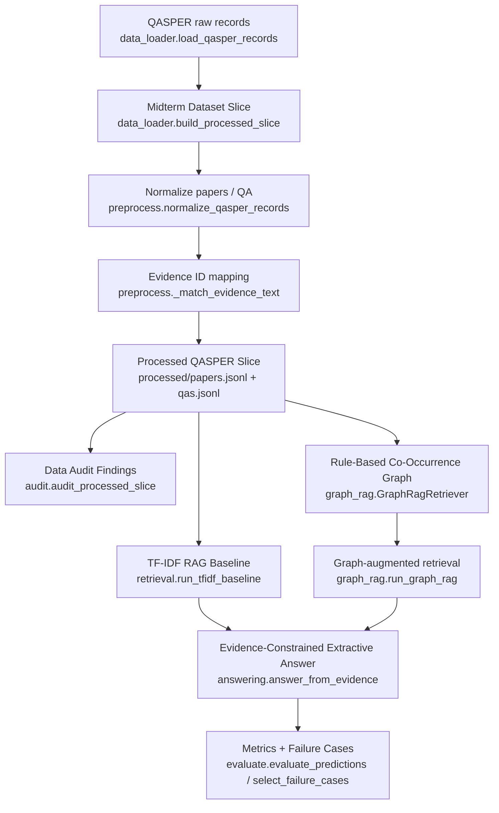
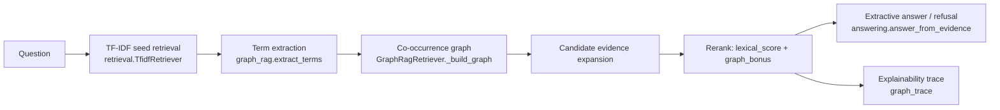

# 数据挖掘课程项目 - 中期进展报告

> 项目当前阶段：中期 GraphRAG 原型已跑通，并完成真实 QASPER 数据验证。当前结果显示检索召回和答案 F1 有提升，但延迟与拒答策略仍需优化。

## 0. 项目基本信息

- **项目名称**：面向计算机科学论文的证据约束型 GraphRAG 问答系统
- **项目链接**：https://github.com/RouVen-crp/DataExcavate_Proj
- **小组成员与分工**：

| 姓名 | 学号 | 组内角色 | 开题以来的核心贡献 | 中期之后的分工规划 |
| :--- | :--- | :--- | :--- | :--- |
| 吴雨霏 | 3220251395 | 数据与审计 | 数据获取、清洗规则确认、数据质量审计 | 扩大数据审计范围，补充问题子集分析 |
| 王文正 | 3120250953 | 数据与审计 | 预处理验收、审计指标核对、运行结果整理 | 复核实验日志，整理报告图表 |
| 唐易成 | 3220251363 | 图谱构建 | 完成中期轻量图检索原型 | 优化实体、关系和边权设计 |
| 李昊 | 3220251322 | 检索与生成 | 完成基线检索、GraphRAG 检索与拒答策略 | 补充对照实验，优化回答质量 |
| 牛煜雯 | 3220251288 | 评测 | 完成核心指标和失败案例输出 | 负责消融实验和最终实验分析 |

## 1. 项目概述与当前状态

### 1.1. 中期里程碑达成情况

- **开题计划目标**：构建面向论文问答的 GraphRAG 系统，通过检索证据和拒答机制降低无依据回答风险，并与常规 RAG 基线进行对比。
- **中期实际达成**：已完成 CPU-only、可一键复现的中期原型，覆盖数据处理、数据审计、基线检索、GraphRAG 检索、抽取式回答、拒答和评测。系统已在小切片和 train split 全量数据上完成验证。

### 1.2. 代码仓库状态审计

- **提交统计**：
  - main 分支总 commit 数：28 次。
  - 开题后新增 commit 数：28 次。
  - 活跃贡献人数：5/5人均有提交。
- **分支与协作方式**：
  - 当前主分支：`main`。
  - 远程仓库：`origin https://github.com/RouVen-crp/DataExcavate_Proj.git`。
  - Git 历史中可见 PR 合并记录，例如 `Merge pull request #9 from yezhuqiu111/main`、`Merge pull request #10 from HUAIJURENSHEN/main` 和 `Merge pull request #11 from codex/full-qasper-validation`。
- **当前仓库目录结构**：

```text
.
├── AGENTS.md                    # agent 工作约定
├── CONTEXT.md                   # 项目领域词汇表
├── README.md                    # 环境配置、一键运行命令、输出文件说明
├── __pycache__
│   └── run_midterm.cpython-314.pyc
├── docs
│   ├── COLLABORATOR_HANDOFF.md
│   ├── PROJECT_HANDOFF.md
│   ├── adr
│   ├── agent_handoff.md
│   ├── agents
│   ├── image
│   ├── 小组项目开题.pdf
│   ├── 小组项目选题和指南.pdf
│   ├── 项目中期进展报告.md
│   └── 项目中期进展报告模板.md
├── requirements.txt             # Python 测试依赖：pytest
├── run_midterm.py               # 一键运行入口，串联数据、检索、回答、评测与导出
├── run_scale_experiments.py     # 分层规模实验入口
├── src/
│   ├── __init__.py
│   ├── __pycache__
│   ├── answering.py             # Evidence-Constrained Extractive Answer 与拒答
│   ├── audit.py                 # 数据审计：长度、evidence 映射、unanswerable 统计
│   ├── data_loader.py           # 本地 JSON/JSONL 与官方 QASPER v0.3 下载缓存
│   ├── evaluate.py              # Evidence Recall@K、Answer Token F1、Refusal Accuracy、失败案例
│   ├── graph_rag.py             # Rule-Based Co-Occurrence GraphRAG、trace 输出
│   ├── preprocess.py            # QASPER 标准化、evidence 映射、Processed QASPER Slice 写出
│   └── retrieval.py             # TF-IDF RAG Baseline
├── tests/                       # pytest 行为测试与 smoke suite
│   ├── __pycache__
│   ├── run_smoke_tests.py
│   ├── test_audit.py
│   ├── test_data_loader.py
│   ├── test_graph_rag.py
│   ├── test_preprocess.py
│   ├── test_refusal_failures.py
│   ├── test_runner_smoke.py
│   └── test_tfidf_baseline.py

9 directories, 30 files
```

## 2. 数据工程与审计落地

### 2.1. 原始数据审计反馈

开题报告确定数据集为 QASPER。中期阶段先审计 train split 小切片：12 篇论文、60 个 QA、1053 个段落；后续又补充 train split 全量验证。运行输出见 `results/qasper_midterm/audit.json`。

**已验证的数据问题**

| 数据问题 | 量化规模 | 当前处理 | 中期结论 |
| :--- | :--- | :--- | :--- |
| 文档长度差异大 | 12 篇中 5 篇超过 4000 words | 段落级检索，见 `src/retrieval.py` | 降低整篇论文直接检索的噪声 |
| 长段落影响答案抽取 | 1053 段中 11 段超过 250 words | 从证据段中抽取相关句子，见 `src/answering.py` | 回答上下文更可控 |
| 部分 evidence 难以映射 | 60 个 QA 中 7 个存在缺失或不完整 | 增加 evidence 匹配与审计记录，见 `src/preprocess.py`、`src/audit.py` | 避免把数据问题误判为模型失败 |
| 存在不可回答问题 | 小切片 18.33%，train split 全量 10.72% | 增加拒答输出与指标统计，见 `src/answering.py`、`src/evaluate.py` | 拒答能力已可度量，但仍需调优 |

**需继续观察的问题**

| 问题 | 中期观察 | 后续处理 |
| :--- | :--- | :--- |
| evidence 部分匹配 | 小切片中未明显出现大量 partial mismatch | 扩大数据后继续观察 |
| 术语别名与实体歧义 | 中期版仅做轻量词项抽取 | 终期继续优化实体规范化 |

### 2.2. 数据流与预处理管道



## 3. 基线模型与核心算法实现

### 3.1. 基线模型运行情况说明

- **开题计划基线**：BM25-RAG（关键词检索 + LLM 生成）和 Dense Vector RAG（段落向量检索 / FAISS + LLM 生成）。
- **中期已实现基线**：TF-IDF RAG Baseline。系统按论文段落检索 top-k 证据，并基于证据抽取回答；BM25 或 Dense Vector RAG 将作为终期增强对照。
- **运行环境**：Windows + Python 3.11 Conda 环境，CPU-only；不依赖外部服务。
- **一键复现命令**：

```bash
python run_midterm.py --max-papers 20 --max-qas 60 --top-k 5 --output-dir results/qasper_midterm
```

- **全量验证命令**：

```bash
python run_midterm.py --max-papers all --max-qas all --top-k 5 --output-dir results/qasper_train_full
```

- **分层对比实验命令**：

```bash
python run_scale_experiments.py --scale 20:60 --scale 100:300 --scale all:all --top-k 5 --output-dir results/scale_experiments
```

分层实验会保存各规模结果，并生成汇总文件 `results/scale_experiments/comparison.json`。

- **关键输出日志片段**：

```text
papers=12 qas=60 output_dir=results\qasper_midterm
baseline_recall@5=0.420 baseline_f1=0.067
graphrag_recall@5=0.460 graphrag_f1=0.083
failure_cases=2
```

- **测试验证**：

```text
D:\miniconda3\envs\dm\python.exe -m pytest
12 passed

D:\miniconda3\envs\dm\python.exe tests\run_smoke_tests.py
smoke tests passed
```

### 3.2. 核心进阶算法开发进度

中期阶段实现了轻量版 GraphRAG：先用基线检索获取候选证据，再基于共现图扩展相关段落并重排。该版本重点验证“图增强检索是否带来收益”，完整实体规范化和更复杂的路径推理留到终期推进。



| 模块 | 对应文件 | 状态 | 备注 |
| :--- | :--- | :---: | :--- |
| 数据预处理 | `src/preprocess.py`、`src/data_loader.py` | 完成 | 支持 QASPER 数据读取和 evidence 映射 |
| 基线检索 | `src/retrieval.py` | 完成 | TF-IDF 段落检索 |
| GraphRAG 原型 | `src/graph_rag.py` | 完成中期版 | 轻量图扩展与重排 |
| 回答与拒答 | `src/answering.py` | 完成中期版 | 抽取式回答和拒答 |
| 评测框架 | `src/evaluate.py` | 完成 | 召回、F1、拒答和延迟指标 |
| 测试 | `tests/` | 完成 | 12 个 pytest 用例和 smoke tests |

## 4. 中期实验结果与阶段性分析

### 4.1. 评估指标与测试集构建

- **评测数据集规模**：主表使用 QASPER train split 小切片：12 篇论文、60 个 QA、1053 个段落；另补充分层实验和 train split 全量验证。
- **中期已落地指标**：Evidence Recall@5、Answer Token F1、Refusal Accuracy、Average Latency。
- **暂未落地指标**：Exact Match、Evidence Precision/F1、Faithfulness、Unsupported Claim Rate 等，计划在终期继续补充。

### 4.2. 定量对比实验结果

| 模型方法 | Evidence Recall@5 | Answer Token F1 | Refusal Accuracy | 平均耗时 |
| :--- | :---: | :---: | :---: | :---: |
| TF-IDF RAG Baseline | 42.00% | 0.067 | 18.18% | **0.42 ms/query** |
| **GraphRAG 中期版** | **46.00% (+4.00%)** | **0.083 (+0.016)** | 18.18% | 24.87 ms/query |

结果说明：在 60 QA 快速复现切片中，GraphRAG 中期版的召回率和答案 F1 有提升，拒答准确率持平，但耗时更高。

### 4.3. 扩大规模与全量验证

小切片结果主要用于快速复现。为避免只根据小样本判断算法效果，项目已补充分层实验和 train split 全量验证。

| 数据规模 | TF-IDF Recall@5 | GraphRAG Recall@5 | TF-IDF F1 | GraphRAG F1 | TF-IDF Latency | GraphRAG Latency |
| :--- | :---: | :---: | :---: | :---: | :---: | :---: |
| 12 篇 / 60 QA | 42.00% | **46.00%** | 0.0671 | **0.0829** | **0.42 ms** | 24.87 ms |
| 73 篇 / 300 QA | 54.40% | **54.40%** | 0.0897 | **0.0947** | **0.65 ms** | 84.28 ms |
| 888 篇 / 2593 QA | 51.07% | **54.55%** | 0.0812 | **0.0909** | **3.95 ms** | 530.02 ms |

全量结果表明，GraphRAG 在 Recall@5 和 Answer Token F1 上整体优于 TF-IDF baseline，但平均延迟明显上升，拒答准确率仍需单独优化。

### 4.4. 实验结果初步诊断与分析

| # | Query 片段 | 模型输出 | 正确答案要点 | 失败原因 | 改进方向 |
| :- | :--- | :--- | :--- | :--- | :--- |
| 1 | What are the results? | `INSUFFICIENT_EVIDENCE` | 多个模型的实验结果 | 结果类段落未被召回 | 提高结果、数值和表格相关证据权重 |
| 2 | What are labels available in dataset for supervision? | `INSUFFICIENT_EVIDENCE` | `negative`、`positive` | 数据集标签信息未被召回 | 加强 dataset/label 相关短语识别 |

- **总体优缺点小结**：当前中期原型已能在真实数据上复现完整流程。GraphRAG 相比 TF-IDF 有小幅提升，但延迟和拒答质量仍是主要短板。终期阶段将重点优化检索扩展、对照基线和拒答策略。

## 5. 后续风险评估与冲刺排期

### 5.1. 风险清单动态调整

| 风险 | 当前状态 | 后续预案 |
| :--- | :--- | :--- |
| 图谱抽取质量不足 | 部分发生；中期版仍是轻量图检索 | 优化实体规范化、边权和检索回退 |
| 算力或外部服务受限 | 已规避；中期版可 CPU-only 运行 | 终期新增能力保持 optional 和可缓存 |
| GraphRAG 延迟较高 | 已发生；全量实验中延迟明显高于基线 | 限制扩展范围，优化索引和重排流程 |
| evidence 映射不完整 | 部分发生；少量样本影响评测 | 继续完善匹配策略，并在报告中单独标注 |

### 5.2. 终期冲刺详细排期（第 13 周 - 第 16 周）

| 周次 | 核心任务 | 责任人 | 交付物 |
| :--- | :--- | :--- | :--- |
| 第 13 周 | 完成中期提交与结果复核 | 吴雨霏、王文正、牛煜雯；全员复核 | 中期报告、运行日志、指标表 |
| 第 14 周 | 补充 BM25 或 Dense RAG 对照，优化检索扩展 | 李昊、唐易成 | 对照实验结果、优化版检索模块 |
| 第 15 周 | 完成主对照和消融实验 | 牛煜雯、李昊、唐易成 | 消融实验表、失败案例分析 |
| 第 16 周 | 整理最终交付与答辩材料 | 全员 | 最终报告、答辩 PPT、Demo 材料 |

## 6. AI 工具辅助使用记录

| 使用场景 | AI 工具名称 | 具体辅助环节 | 团队审查与纠错说明 |
| :--- | :--- | :--- | :--- |
| 代码修改 | Codex | 辅助实现数据处理、检索、回答和评测模块 | 使用本地测试和真实数据运行验证 |
| 开题阶段材料组织 | ChatGPT / Cursor | 辅助梳理报告初稿和技术路线 | 团队成员人工审查与修改 |
| 中期报告检查 | Codex | 对照模板检查报告完整性和表达 | 团队成员定夺修改项并复核 |

> **中期自查清单 (Self-Check List)**（提交前逐项确认）：
>
> **代码仓库**
>
> - [X] GitHub 仓库已设为公开，且近两周内有真实的 commit 记录？
> - [X] 仓库 README.md 包含环境配置说明和一键复现命令，他人可独立运行？
> - [X] 所有组员至少有 1 次 commit？
>
> **数据与实验**
>
> - [X] 数据审计表已填写，每条问题都给出了量化规模（百分比/数量）？
> - [X] 基线模型已完整跑通，报告中有实际的终端输出或截图为证？
> - [X] 进阶模型与基线已进行定量对比（有数字，不只是文字描述）？
> - [X] 误差分析部分包含至少 2 个具体的失败案例？
>
> **报告完整性**
>
> - [X] 所有成员的分工和开题后的具体贡献都明确写入了成员分工表？
> - [X] 后续冲刺排期精确到周，责任人明确，且与当前进度匹配？
> - [X] AI 工具使用情况已如实填写（未使用也须注明）？

## 附录：

### GitHub Insights 截图


