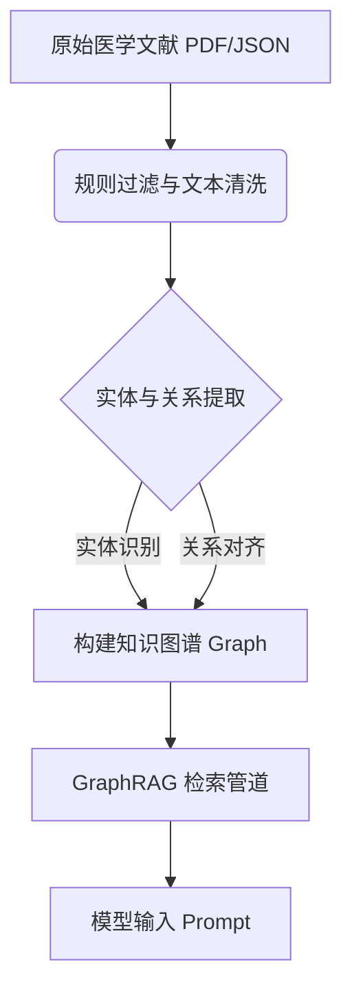

# 数据挖掘课程项目 - 中期进展报告模板

> 本阶段重点考核：**数据预处理与审计的落地情况**、**基线模型的跑通与评测**、**核心算法的开发进度**以及**后续关键里程碑的规划**。请各小组在 **第 13 周** 提交本报告。
> 
> **提交要求**：
> 1. 一份格式规范的 **PDF 中期进展报告**（建议控制在 5-8 页以内，重点突出，附带必要的定量实验图表）。
> 2. 持续更新的 **代码仓库链接**（将检查代码提交历史、模块划分与运行说明）。

---

## 0. 项目基本信息

- **项目名称**：[请填写你的项目名称，如：基于 GraphRAG 的医学文献抗幻觉问答系统]
- **项目链接**：[请填写公开的代码仓库 URL] 
- **小组成员与分工**：
  | 姓名 | 学号 | 组内角色 | 开题以来的核心贡献 | 中期之后的分工规划 |
  | :--- | :--- | :--- | :--- | :--- |
  | 张三（组长） | 2026xxxx | 算法开发 | 完成基线模型搭建与核心图检索模块实现 | 调优进阶模型，撰写最终报告 |
  | 李四 | 2026xxxx | 数据工程 | 负责医学文献清洗、实体关系提取与图谱构建 | 配合消融实验，丰富测试集 |
  | 王五 | 2026xxxx | 评测与实验 | 设计对比评测框架，完成首批实验结果统计 | 运行消融实验，绘制定量分析图表 |

---

## 1. 项目概述与当前状态

### 1.1. 中期里程碑达成情况
*对比开题时制定的里程碑，目前项目处于什么阶段？（如：按计划进行 / 进度提前 / 进度滞后，并说明原因）。*
- **计划目标**：[如：在第11周跑通基线模型并完成数据图谱化]
- **实际达成**：[如：已成功跑通 baseline 并完成 80% 数据清洗，图谱构建因实体对齐问题延迟了 3 天，但目前已解决]

### 1.2. 代码仓库状态审计
- **提交统计**（必填，可通过 `git log --oneline | wc -l` 获取）：
  - 总 commit 数：[如 47 次]，开题后新增 commit 数：[如 32 次]
  - 活跃贡献人数：[如 3/3 人均有提交]（GitHub Insights 截图可附在附录）
- **分支与协作方式**：[例：使用 3 个 Feature Branch（`feature/preprocess`、`feature/graph-build`、`feature/evaluate`），通过 PR 合并，共完成 8 次 PR review]
- **当前仓库目录结构**（运行 `tree -L 2` 并粘贴实际输出，不可使用示例结构替代）：
  ```text
  # 请在此处粘贴你的仓库实际目录结构，并在右侧注释说明各模块的功能
  ├── README.md               # 运行说明与环境配置（含一键复现命令）
  ├── data/
  │   ├── raw/                # 原始数据（或提供下载脚本 data/download.sh）
  │   └── processed/          # 清洗后的中间数据
  ├── src/
  │   ├── preprocess.py       # [说明：实现了哪些清洗步骤]
  │   ├── baseline.py         # [说明：基线方法及评测入口]
  │   ├── core_model.py       # [说明：进阶算法的核心逻辑]
  │   └── evaluate.py         # [说明：评测指标计算逻辑]
  ├── notebooks/
  └── requirements.txt
  ```

---

## 2. 数据工程与审计落地

### 2.1. 原始数据审计反馈
**必填**：请至少列出 **2 条**经代码验证的数据问题。如开题预测的某项挑战未发生，也请在最后一行明确注明原因。

| 数据问题 | 量化规模 | 解决方案（精确到文件/函数） | 处理后效果 |
| :--- | :--- | :--- | :--- |
| 噪声标签 | 15.3% 样本标签存在冲突 | Snorkel LabelModel 多源融合，见 `src/preprocess.py` L42-89 | 标签冲突率降至 2.1%，Precision +4.7% |
| 实体长尾分布 | 63% 的实体出现次数 < 3 | 频次过滤 + 实体消歧，见 `notebooks/eda.ipynb` Cell 12 | 图谱节点数 12 万压缩至 3.8 万，查询平均跳数 -1.2 |
| [请填写，不得留空] | | | |

### 2.2. 数据流与预处理管道
**必填**：使用 Mermaid 流程图展示数据从原始状态到送入模型的完整流水线，每个节点须标注对应的脚本文件名或函数名（不接受纯文字替代）。



---

## 3. 基线模型与核心算法实现

### 3.1. 基线模型运行情况说明
**必填**：中期阶段基线模型必须已可完整运行并输出评测结果。

- **所选基线方法**：[例如：Vector-based RAG，BGE-M3 向量检索 + Qwen3.5-9B]
- **运行环境**：[例如：单张 RTX 3090 24G，Python 3.11，推理耗时约1.2s/query]
- **一键复现命令**（必填，评审会实际执行验证）：
  ```bash
  # 示例，请替换为你的实际命令
  python src/baseline.py --data data/processed/test.jsonl --output results/baseline.json
  ```
- **关键输出截图或日志片段**：[在此粘贴运行成功的终端输出关键行，或附图于附录]

### 3.2. 核心进阶算法开发进度
*介绍你们针对开题问题设计的进阶算法或创新模块。*
- **核心模块设计**：请用系统架构图（Mermaid）或文字，阐述进阶方法的设计原理（如：在 GraphRAG 中引入层次化社群检索 Community Summary）

- **开发进度核查表**（必填，逐项如实勾选）：

  | 模块 | 对应文件 | 状态 | 备注 |
  | :--- | :--- | :---: | :--- |
  | 数据预处理管道 | `src/preprocess.py` | 完成 / 进行中 / 未开始 | |
  | 基线模型 | `src/baseline.py` | 完成 / 进行中 / 未开始 | |
  | 核心进阶算法 | `src/core_model.py` | 完成 / 进行中 / 未开始 | |
  | 评测框架 | `src/evaluate.py` | 完成 / 进行中 / 未开始 | |
  | 单元测试 / 集成测试 | `tests/` | 完成 / 进行中 / 未开始 | |

---

## 4. 中期实验结果与阶段性分析

### 4.1. 评估指标与测试集构建
- **评测数据集规模**：[例如：人工标注了 50 个复杂的多跳推理问答对作为 Benchmark 测试集]
- **核心评测指标 (Metrics)**：[如：准确率 Accuracy、幻觉率 Hallucination Rate (基于 RAGAS 评估框架)、检索召回率 Recall@K]

### 4.2. 定量对比实验结果
*请给出基线模型与当前进阶模型（即使是初代版本）的定量对比表格。*

| 模型方法 (Method) | 检索召回率 (Recall@5) | 答案忠实度 (Faithfulness) | 答案相关性 (Answer Relevance) | 平均推理耗时 (Latency) |
| :--- | :---: | :---: | :---: | :---: |
| Baseline (Vector RAG) | 72.4% | 0.61 | 0.74 | **1.2s** |
| **Proposed (GraphRAG - Midterm Ver.)** | **88.6% (+16.2%)** | **0.84 (+0.23)** | **0.81 (+0.07)** | 3.5s (-2.3s) |

### 4.3. 实验结果初步诊断与分析
**必填**：至少列出 **2 个**具体的失败案例。

| # | 输入（Query 片段） | 模型输出 | 正确答案 | 失败原因 | 改进方向 |
| :- | :--- | :--- | :--- | :--- | :--- |
| 1 | 糖尿病与高血压的共病机制？ | 答案遗漏了胰岛素抗性路径 | 包含胰岛素抗性 + RAS 轴 | 相关实体在图谱中被孤立节点过滤掉 | 放宽频次过滤阈値，或引入语义相似度补充稀疏实体 |
| 2 | [请填写真实失败案例] | | | | |

- **总体优缺点小结**（2-4 句话）：[例如：多跳推理召回率显著提升，但推理延迟从 1.2s 升至 3.5s，下一步需优化图索引并引入并行查询]

---

## 5. 后续风险评估与冲刺排期

### 5.1. 风险清单动态调整
*开题报告中提到的风险是否发生？是否出现了新的非技术/技术风险？*
- **风险 1 状态评估**：[例如：开题提到的算力不足风险未发生，我们成功申请到了实验室的 A100 资源]
- **新增风险与应对预案**：[例如：实体提取的 API 调用费用超出预算。预案：切换为开源的本地部署 Qwen-2-7B-Instruct 提取实体，并设计 Few-shot Prompt 保持准确率]

### 5.2. 终期冲刺详细排期（第 13 周 - 第 16 周）
*请给出精确到周的后续工作计划，确保项目能够按时、高质量地交付。*

| 周次 | 核心任务目标 | 责任人 | 预期交付物 / 验收标准 |
| :--- | :--- | :--- | :--- |
| **第 13 周** | 解决中期暴露的 Latency 问题，优化图查询性能，跑通消融实验 | 张三、王五 | 图检索模块优化版代码、消融实验初步数据 |
| **第 14 周** | 进行大规模测试，收集消融实验与对比实验的完整数据，完成图表绘制 | 王五 | 实验结果可视化图表、详细的指标分析报告 |
| **第 15 周** | 整理代码仓库，撰写最终项目报告（规范学术论文格式），录制 Demo 视频 | 全员 | GitHub 规范化 Release、演示视频、论文初稿 |
| **第 16 周** | 制作答辩 PPT，进行组内试讲，准备最终的项目答辩与成果展示 | 全员 | 最终答辩 PPT、系统演示 Demo |

---

## 6. AI 工具辅助使用记录

按照课程规范，请如实填写。若完全未使用 AI 工具，在表格中注明“未使用”即可。

| 使用场景 | AI 工具名称 | 具体辅助环节（精确到文件/功能） | 团队审查与纠错说明 |
| :--- | :--- | :--- | :--- |
| 代码编写 | DeepSeek | 辅助编写 `src/preprocess.py` 中的正则匹配逻辑 | 逐行 Review，修复了空值处理的 Bug |
| 报告撰写 | 豆包 | 润色系统架构部分的文字描述 | 组长人工核对，删除空泛词汇，确保与代码一致 |
| 算法思路 | Claude 3.5 | 咨询图检索延迟优化的并行方案 | 方案经组内讨论后独立实现，非直接复制 |
| [其他/未使用] | | | |

---

> **中期自查清单 (Self-Check List)**（提交前逐项确认）：
>
> **代码仓库**
>
> - [ ] GitHub 仓库已设为公开，且近两周内有真实的 commit 记录？
> - [ ] 仓库 README.md 包含环境配置说明和一键复现命令，他人可独立运行？
> - [ ] 所有组员至少有 1 次 commit？
>
> **数据与实验**
> - [ ] 数据审计表已填写，每条问题都给出了量化规模（百分比/数量）？
> - [ ] 基线模型已完整跑通，报告中有实际的终端输出或截图为证？
> - [ ] 进阶模型与基线已进行定量对比（有数字，不只是文字描述）？
> - [ ] 误差分析部分包含至少 2 个具体的失败案例？
>
> **报告完整性**
> - [ ] 所有成员的分工和开题后的具体贡献都明确写入了成员分工表？
> - [ ] 后续冲刺排期精确到周，责任人明确，且与当前进度匹配？
> - [ ] AI 工具使用情况已如实填写（未使用也须注明）？
