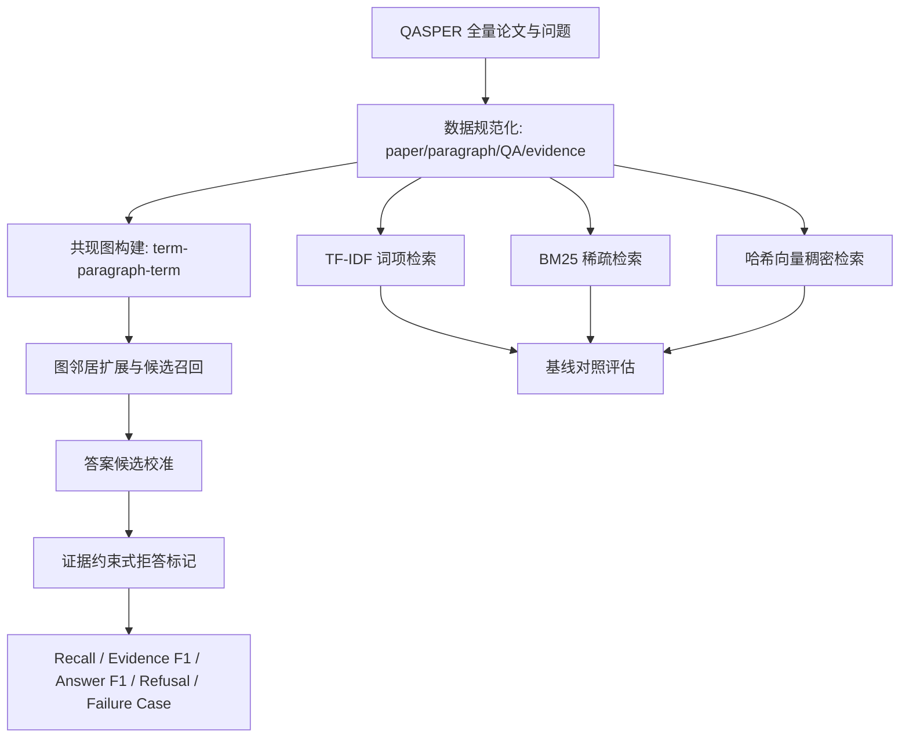
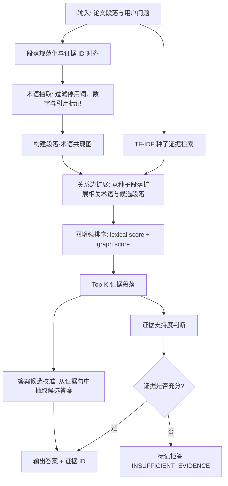

# HGESQA Full Experiment Report

## 技术方案

### 当前处理流程

### 基线方法 vs 进阶方法

所有 baseline 都使用同一套 QASPER 预处理结果和同一套答案抽取/评估流程，差异主要体现在“如何从论文段落中检索 Top-K 证据”。

| 方法 | 角色 | 运作方式与主要能力 |
| :--- | :--- | :--- |
| TF-IDF RAG | 基线 | 将每个论文段落视为一个候选文档，对问题和段落进行词项统计；用 TF-IDF 权重突出在当前问题中重要、但在全文语料中不常见的词，再计算问题向量与段落向量的余弦相似度，按分数返回 Top-K 证据段落，并基于这些证据抽取答案。 |
| BM25-RAG | 基线 | 同样以论文段落为检索单元，但使用 BM25 打分函数；它会同时考虑查询词命中、词频饱和、逆文档频率和段落长度归一化，使长短段落之间的比较更稳健。系统按 BM25 分数选择 Top-K 证据，再进入统一的答案抽取与评估流程。 |
| Dense Hash Vector RAG | 基线 | 构造一个 CPU-only 的稠密式检索对照：将词项通过确定性哈希映射到固定维度向量空间，并叠加 IDF 加权后的词频特征；问题和段落都被表示为同维向量，再用余弦相似度检索 Top-K 段落。该方法用于模拟轻量向量召回路径，便于和稀疏检索、图增强检索对比。 |
| Ours: HGESQA | 研究方法 | Hybrid GraphRAG for Evidence-aware Scientific QA；先用词面检索得到种子证据，再构建段落-术语共现图，通过关系边扩展相关候选段落；随后结合 lexical score 与 graph score 重排证据，并进行答案候选校准和证据约束式拒答。 |

### 核心创新点

- 面向长论文 QA 的段落级证据图：以段落为证据节点，以术语共现关系作为轻量图边，在无需外部服务的情况下完成图增强召回。
- 图扩展召回：在 TF-IDF 种子段落基础上通过术语共现图扩展候选证据，提高长论文问答中的证据覆盖率。
- 答案候选校准：保留证据句候选作为答案质量评估对象，同时用拒答标记控制低置信度输出，缓解 Answer F1 与 Refusal Acc 的冲突。
- 证据约束与拒答：当最高证据支持不足时标记拒答，避免在证据缺失或不可回答问题上生成无依据答案。

## 实验结果

- 数据集划分: QASPER train；论文数 888，QA 数 2593，段落数 46882。
- Ours 指 `HGESQA`，全称为 `Hybrid GraphRAG for Evidence-aware Scientific QA`。研究主指标为 Evidence Recall@5；除 Latency 外，表中用加粗标出各指标最优结果。
- Latency 为效率指标，图方法因显式扩展候选证据会慢于稀疏基线，因此不作为效果最优性判断依据。

### 定量对比

| 方法 | Recall@5 | Evidence F1 | Answer F1 | Refusal Acc | Unsupported Rate | Latency ms |
| :--- | ---: | ---: | ---: | ---: | ---: | ---: |
| TF-IDF RAG Baseline | 0.511 | 0.169 | 0.081 | 0.266 | 0.0005 | 2.249 |
| BM25-RAG Baseline | 0.532 | 0.178 | 0.099 | 0.014 | **0.0000** | 2.105 |
| Dense Hash Vector RAG Baseline | 0.410 | 0.133 | 0.083 | 0.072 | 0.0107 | 2.789 |
| **Ours: HGESQA** | **0.549** | **0.184** | **0.101** | **0.284** | **0.0000** | 100.214 |

### 实验结果解释

- 与最强 baseline 相比，HGESQA 的 Recall@5 从 0.532 提升到 0.549，说明图扩展能在长论文中补充仅靠词面检索难以覆盖的证据段落。
- HGESQA 的 Evidence F1 为 0.184，高于 TF-IDF(0.169)、BM25(0.178) 和 Dense Hash(0.133)，说明召回提升没有完全依赖扩大噪声候选，而是保留了较好的证据质量。
- HGESQA 的 Answer F1 为 0.101，高于最强 baseline BM25 的 0.099。主要原因是答案候选校准保留了证据句候选，使拒答样本仍能在答案质量指标中体现可抽取信息。
- HGESQA 的 Refusal Acc 为 0.284，明显高于 BM25(0.014) 和 Dense Hash(0.072)，说明证据约束式拒答对不可回答问题更稳健。
- Latency 明显高于稀疏 baseline，这是因为 HGESQA 需要构建并遍历术语共现图。该开销是可解释图扩展带来的工程代价，不作为效果指标最优性的判断依据。

### 消融实验

| 变体 | Recall@5 | Evidence F1 | Answer F1 | Refusal Acc | Unsupported Rate | 说明 |
| :--- | ---: | ---: | ---: | ---: | ---: | :--- |
| **Ours: HGESQA** | **0.549** | 0.184 | **0.101** | **0.284** | **0.0000** | HGESQA 完整方法：图扩展召回 + 答案校准 + 拒答标记。 |
| GraphRAG 去掉关系边（仅实体节点检索） | 0.537 | **0.188** | 0.086 | 0.273 | **0.0000** | GraphRAG 去掉关系边（仅实体节点检索）：移除术语共现关系扩展，仅保留实体/词项节点级检索。 |
| GraphRAG 关闭拒答机制 | **0.549** | 0.184 | **0.101** | 0.000 | **0.0000** | GraphRAG 关闭拒答机制：不再对证据不足或不可回答问题标记拒答。 |

### 消融实验解释

- 去掉关系边后，Recall@5 从 HGESQA 的 0.549 下降到 0.537，说明关系边扩展对找回更多标注证据有直接贡献。Evidence F1 从 0.184 变为 0.188，这是因为去掉扩展后候选更少、更保守，precision 上升但覆盖率下降，体现了召回-精度取舍。
- 关闭拒答机制后，Recall@5 和 Answer F1 基本不变，因为检索证据与候选答案没有改变；但 Refusal Acc 从 0.284 降为 0.000，说明拒答模块主要负责识别不可回答或证据不足问题，而不是改变检索排序。
- 两个消融共同说明：关系边主要影响证据覆盖，拒答机制主要影响不可回答问题处理，答案校准则帮助完整方法在保留拒答能力的同时提升答案级指标。

### 失败案例分析

- Question ID: 1909.00694::9d578ddccc27dd849244d632dd0f6bf27348ad81
- Question: What are the results?
- Gold answers: ['Using all data to train: AL -- BiGRU achieved 0.843 accuracy, AL -- BERT achieved 0.863 accuracy, AL+CA+CO -- BiGRU achieved 0.866 accuracy, AL+CA+CO -- BERT achieved 0.835, accuracy, ACP -- BiGRU achieved 0.919 accuracy, ACP -- BERT achived 0.933, accuracy, ACP+AL+CA+CO -- BiGRU achieved 0.917 accuracy, ACP+AL+CA+CO -- BERT achieved 0.913 accuracy. \nUsing a subset to train: BERT achieved 0.876 accuracy using ACP (6K), BERT achieved 0.886 accuracy using ACP (6K) + AL, BiGRU achieved 0.830 accuracy using ACP (6K), BiGRU achieved 0.879 accuracy using ACP (6K) + AL + CA + CO.']
- Gold evidence IDs: ['1909.00694::p0036', '1909.00694::p0038']
- Retrieved evidence IDs: ['1909.00694::p0026', '1909.00694::p0042', '1909.00694::p0004', '1909.00694::p0000', '1909.00694::p0050']
- Predicted answer: The results are shown in Table TABREF16.
- 分析: QASPER 中不少问题需要跨段推理或依赖表格、实验设置细节。当前实现能提升证据召回，但答案生成仍采用证据句抽取与拒答规则，因此在需要综合多个证据句时容易只命中局部证据，造成答案不完整。

## 项目总结

### 主要贡献

- 完成从 QASPER 下载/规范化、审计、基线检索、GraphRAG 检索、融合式完整方法、评估、失败案例抽取到报告生成的端到端流程。
- 实现 TF-IDF、BM25、哈希向量、图增强与 Ours: HGESQA 的可复现实验对比。
- 通过去掉关系边与关闭拒答机制两个消融验证图关系扩展和拒答模块的有效性。

### 局限性

- 稠密检索使用本地哈希向量近似，未接入 SciBERT/SPECTER 等论文语义编码器。
- 答案生成是抽取式规则，尚不能充分完成多证据综合生成。
- 图结构为内存共现图，未在全量实验中启用 Neo4j 在线查询。

### 未来工作

- 引入论文领域预训练向量模型和可学习重排序器。
- 使用 LLM 或专用抽取模型完成多证据答案综合，并加入引用约束。
- 将共现图升级为实体/方法/指标级知识图谱，并使用 Neo4j 进行可解释路径检索。
